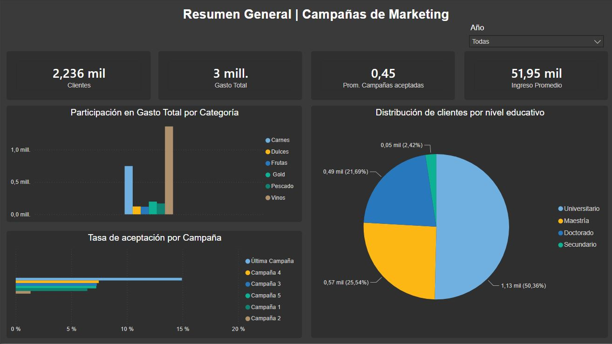
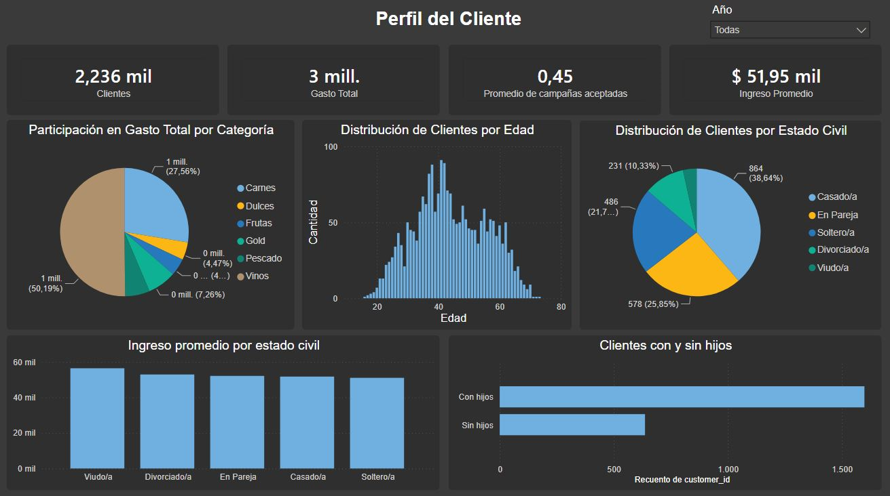
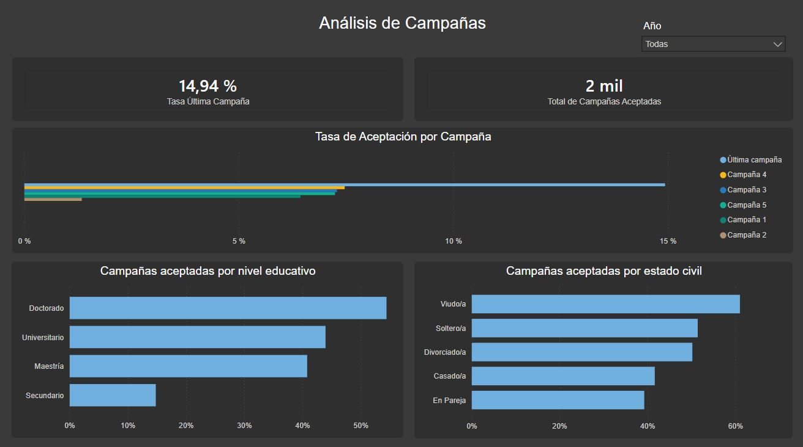
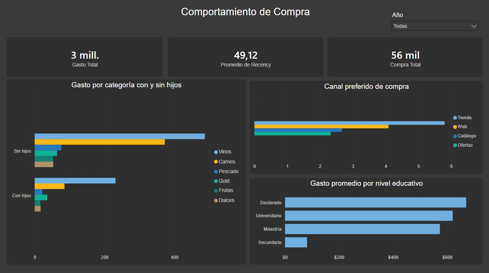

# 📊 Customer Segmentation & Campaign Effectiveness Analysis

Análisis end-to-end del comportamiento de clientes y efectividad de campañas de marketing para Maven Marketing, combinando **Python**, **MySQL** y **Power BI**.

**Dataset:** [Marketing Campaign (Kaggle)](https://www.kaggle.com/datasets/rodsaldanha/arketing-campaign) — 2.240 clientes, 29 variables.

---

## 🎯 Objetivo

Analizar el comportamiento de compra de los clientes y su respuesta a 5 campañas de marketing históricas, con el fin de identificar patrones accionables que mejoren la efectividad de futuras campañas.

## ❓ Preguntas de negocio

1. ¿Cuál fue la campaña con mayor tasa de conversión?
2. ¿Qué perfil demográfico acepta más campañas?
3. ¿El ingreso del cliente impacta en el gasto por categoría?
4. ¿Tener hijos en el hogar afecta el tipo de producto comprado?
5. ¿Qué canal de compra genera más volumen?

---

## 🛠️ Stack utilizado

| Etapa | Herramientas |
|---|---|
| Análisis exploratorio | Python (pandas, matplotlib, seaborn) |
| Modelado de datos | MySQL (star schema, staging, JOINs) |
| Visualización | Power BI (DAX, Power Query) |

---

## 📁 Estructura del proyecto

### Etapa 1 — EDA en Python
- Carga del dataset con separador `;`
- Tratamiento de nulos en `Income` (imputación con mediana)
- Eliminación de outliers (edades >90 años, ingreso atípico de $666.666)
- Normalización de categorías (`Marital_Status`, `Education`)
- Columnas derivadas: `Age`, `Total_Spending`, `Total_Campaigns_Accepted`, `Has_Children`
- Segmentación RFM (Recency, Frequency, Monetary)
- 6+ visualizaciones exploratorias y mapa de correlaciones

### Etapa 2 — Modelado dimensional en MySQL
Se construyó un **star schema** sobre una tabla de staging:

```
fact_purchases
    ↕
dim_customer — dim_campaign — dim_fecha
```

- `dim_customer`: perfil demográfico del cliente (edad, educación, estado civil, hijos, ingreso)
- `dim_campaign`: catálogo de las 6 campañas
- `dim_fecha`: dimensión de tiempo (año, mes, trimestre, día de la semana)
- `fact_purchases`: métricas de comportamiento — gasto por categoría, canal de compra, respuesta a campañas

Se realizaron consultas analíticas con `JOIN`, `GROUP BY` y funciones de agregación para responder las preguntas de negocio directamente en SQL.

### Etapa 3 — Dashboard en Power BI
Dashboard de **4 páginas** con interactividad completa (filtro por año, segmentación cruzada entre visuales):

1. **Resumen General** — KPIs globales, gasto por categoría, tasa de aceptación por campaña, distribución educativa
2. **Perfil del Cliente** — edad, estado civil, ingreso, presencia de hijos
3. **Análisis de Campañas** — tasa de aceptación por campaña, por nivel educativo y por estado civil
4. **Comportamiento de Compra** — canal preferido, gasto por categoría según hijos, gasto por nivel educativo

---

## 💡 Principales insights

| Insight | Detalle |
|---|---|
| Perfil típico | Cliente de 40-45 años, ingreso mediano de $51.381, nivel universitario |
| Categorías | Vinos y Carnes concentran ~75% del gasto total |
| Campañas | La última campaña (Response) tuvo 14,9% de aceptación — más del doble que cualquier otra |
| Hijos | Clientes sin hijos gastan significativamente más (especialmente en vinos y carnes) y tienen mayor poder adquisitivo |
| Canales | La tienda física lidera, seguida de cerca por la web |
| Segmentación | Viudos y solteros muestran mayor tasa de aceptación de campañas que casados/en pareja |

---

## 📷 Capturas del dashboard

### Resumen General


### Perfil del Cliente


### Análisis de Campañas


### Comportamiento de Compra


---

## 🚀 Cómo replicarlo

1. Descargar el dataset desde Kaggle
2. Ejecutar el notebook de EDA (`marketing_campaign_EDA.ipynb`)
3. Cargar el CSV limpio en MySQL siguiendo el script de creación de tablas (`schema.sql`)
4. Conectar Power BI a los CSVs exportados desde MySQL o directamente a la base de datos
5. Abrir el archivo `.pbix` para explorar el dashboard interactivo

---

## 👤 Autor

**Nicolás Acevedo** — Data Analyst en formación (Digital House)
[Portfolio](https://nacevedo-data.github.io) · [LinkedIn](#)
